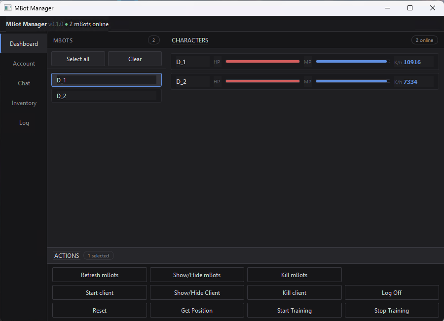
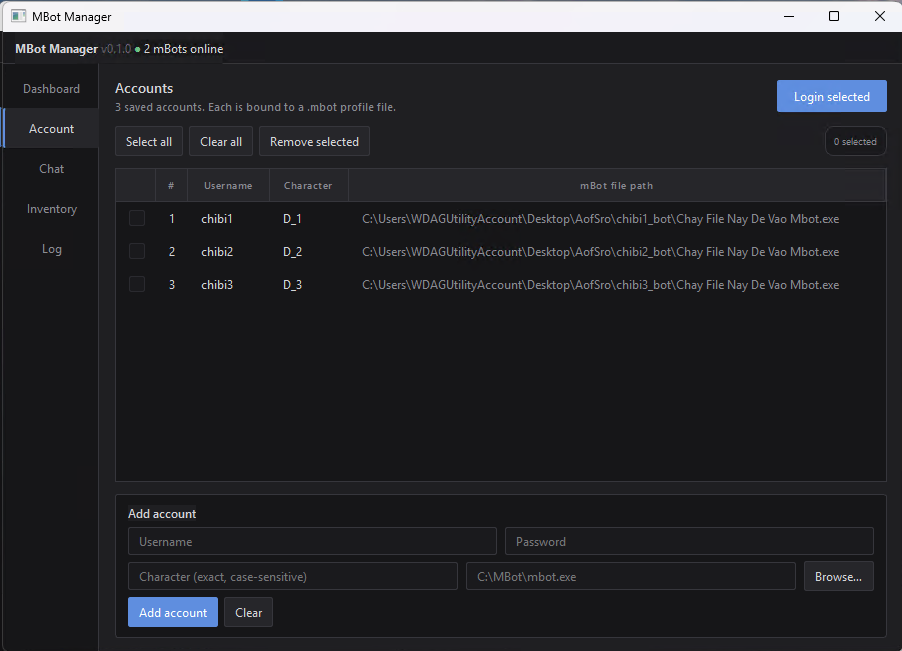
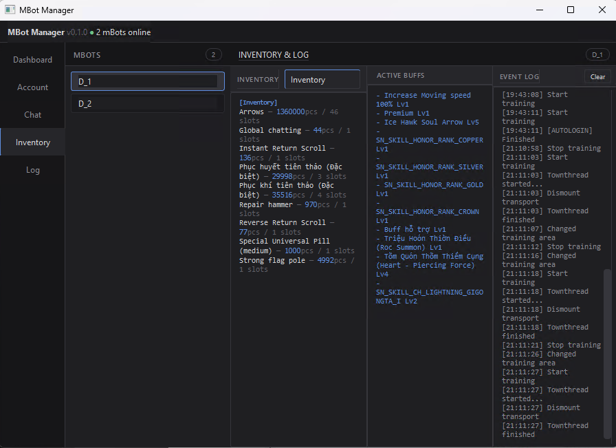

# mBot Manager

Công cụ hỗ trợ quản lý nhiều mBot cùng lúc trên Silkroad Online (vSRO 110).

> **Lưu ý:** Tool này không thay thế mBot. Bạn cần cài đặt và cấu hình mBot đầy đủ trước (profile, script, settings). mBot Manager chỉ hỗ trợ tự động hóa các thao tác lặp đi lặp lại mỗi khi tắt/mở máy — mở mBot, đăng nhập, bắt đầu train, ẩn cửa sổ.

---

## Tải về

1. Bấm nút **Code** (màu xanh lá, góc phải trên)
2. Chọn **Download ZIP**
3. Giải nén vào thư mục tùy ý, ví dụ `C:\MBotManager`

---

## Cài đặt lần đầu

Double-click `setup.bat` — script tự tải Python 3.11 portable và cài dependencies (~5 phút, cần internet). Không ảnh hưởng đến Python đã cài trên máy.

---

## Sử dụng hàng ngày

Double-click `launch.bat` để mở.

Hoặc `launch_autologin.bat` để mở và tự động login tất cả account luôn.

---

## Tính năng

**Dashboard** — xem danh sách mBot đang chạy, theo dõi HP/MP/K/h theo thời gian thực, điều khiển hàng loạt.

| Nút | Tác dụng |
|---|---|
| Refresh mBots | Quét lại danh sách cửa sổ mBot |
| Show/Hide mBots | Ẩn/hiện cửa sổ mBot |
| Kill mBots | Đóng mBot |
| Start/Kill Client | Bật/tắt SRO client |
| Show/Hide Client | Ẩn/hiện SRO client |
| Log Off | Đăng xuất nhân vật |
| Reset | Reset mBot |
| Get Position | Lấy tọa độ hiện tại |
| Start/Stop Training | Bắt đầu/dừng train |

Chọn nhiều mBot bằng Ctrl+click hoặc **Select all**.

---

**Account** — lưu thông tin đăng nhập và tự động chạy toàn bộ trình tự mỗi khi khởi động lại máy:

1. Mở `mbot.exe`
2. Click Start Client → chờ SRO client load
3. Chọn server → nhập tài khoản/mật khẩu → vào game
4. Start Training → ẩn SRO client → ẩn cửa sổ mBot

Nếu mBot của account đó đã đang mở thì bỏ qua, không mở thêm.

Mật khẩu lưu dạng base64 trong `accounts.json` — giữ file này riêng tư, không chia sẻ.

---

**Chat** — xem nội dung chat theo kênh (Allchat, PM, Party, Guild, Global, Academy, GM, Union, Unique). Tự refresh mỗi 20 giây.

---

**Inventory & Log** — xem inventory theo loại (Avatar, Fellow, Guildstorage, Inventory, Pet, Storage), active buffs, và event log của mBot.

---

**Log** — lịch sử hoạt động của tool: scan, login, lỗi, v.v.

---

## Lưu ý

- Chỉ chạy trên **Windows**.
- Login sequence dùng delay cố định — máy yếu hoặc mạng lag có thể cần điều chỉnh thời gian chờ trong code.
