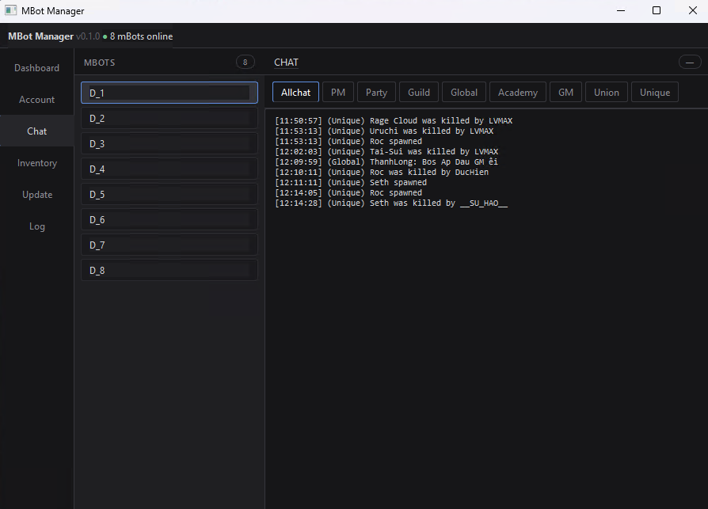
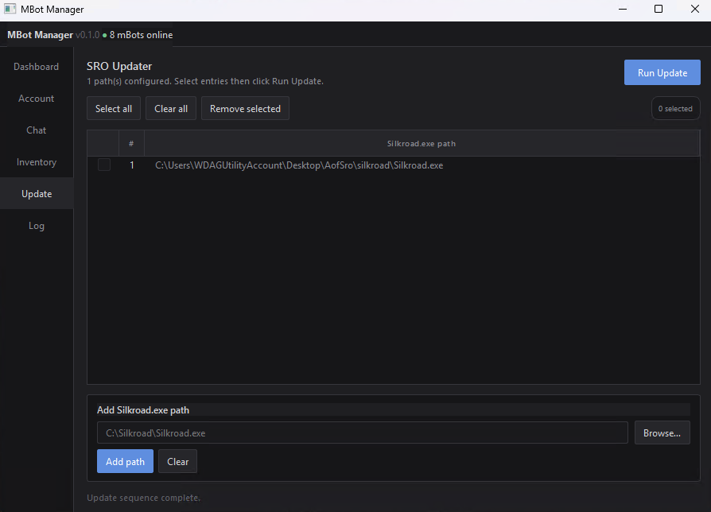
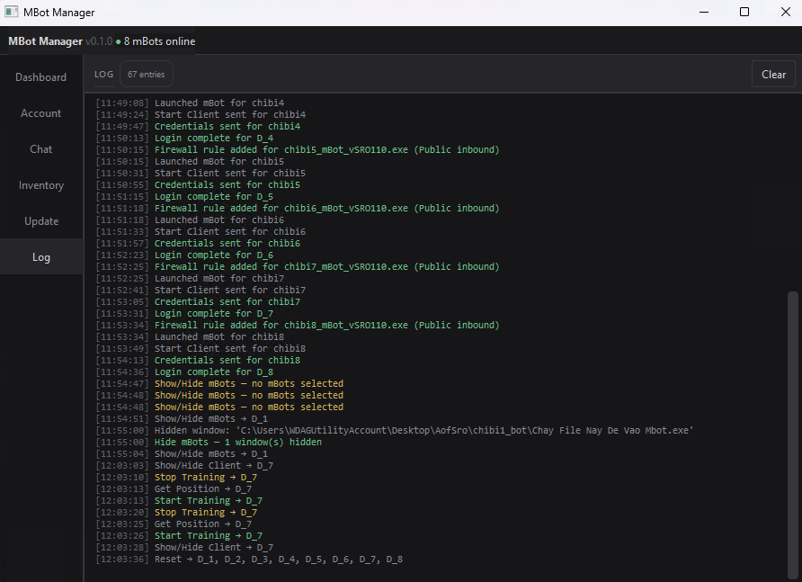

# mBot Manager

A tool for managing multiple mBot windows simultaneously on Silkroad Online (vSRO 110).

> **Note:** This tool does not replace mBot. You must install and fully configure mBot first (profile, script, settings). mBot Manager only automates repetitive tasks on each startup — opening mBot, logging in, starting training, hiding windows, and updating the SRO client.

---

## Download

1. Click the **Code** button (green, top right)
2. Select **Download ZIP**
3. Extract to any folder, e.g. `C:\MBotManager`

---

## First-time Setup

Double-click `setup.bat` — it automatically downloads Python 3.11 portable and installs all dependencies (~5 minutes, internet required). Does not affect any existing Python installation on your machine.

---

## Daily Use

Double-click `launch.bat` to open.

Or use the following batch files to automate on startup:

| File | Action |
| --- | --- |
| `launch.bat` | Open the tool normally |
| `launch_autologin.bat` | Open, update first, then auto-login |
| `sandbox.bat` | Hide and visible the Sandbox Window |

---

## Features

### Dashboard


View all running mBot windows, monitor HP/MP/K/h in real time, and control them in bulk.

| Button | Action |
| --- | --- |
| Refresh mBots | Re-scan for active mBot windows |
| Show/Hide mBots | Toggle mBot window visibility |
| Kill mBots | Close mBot |
| Start/Kill Client | Start or kill the SRO client |
| Show/Hide Client | Toggle SRO client visibility |
| Log Off | Log out the character |
| Reset | Reset mBot |
| Get Position | Fetch current coordinates |
| Start/Stop Training | Start or stop training |

Select multiple mBots with Ctrl+click or **Select all**.

---

### Account


Save login credentials and automatically run the full login sequence on each restart:

1. Launch `mbot.exe`
2. Click Start Client → wait for SRO client to load
3. Select server → enter username/password → enter game
4. Start Training → hide SRO client → hide mBot window

If mBot for that account is already open, it is skipped.

Once all accounts have finished logging in, the tool automatically hides all mBot windows.

Passwords are stored as base64 in `accounts.json` — keep this file private, do not share it.

| Button | Action |
| --- | --- |
| Login selected | Run the login sequence for selected accounts |
| Hide mBots | Hide mBot windows by their exe filename |

---

### Chat


View chat content by channel (Allchat, PM, Party, Guild, Global, Academy, GM, Union, Unique). Auto-refreshes every 20 seconds.

---

### Inventory & Log


View inventory by type (Avatar, Fellow, Guildstorage, Inventory, Pet, Storage), active buffs, and the mBot event log.

---

### Update


Manage and automatically update SRO clients (`Silkroad.exe`). Add paths to each `Silkroad.exe`, select them, and click **Run Update**.

Update sequence per file:

1. Kill any running `silkroad.exe` process
2. Launch `Silkroad.exe`
3. Check the number of window controls every 10 seconds
4. If controls reach the target (update complete) → kill process → move to next file
5. If 60 seconds pass with no completion → kill process → move to next file

**Automatic monitoring:**

Every 2 minutes, the tool checks all `sro_client.exe` windows:

| Dialog | Action |
| --- | --- |
| `BSObj Plugin` | Click OK + trigger update sequence |
| `NetError` | Click OK only, no update |

Paths are saved in `updater.json`.

---

### Log


Activity history of the tool: scans, logins, updates, errors, etc.

---

## Command-line Arguments

```
python mbot_manager.py [--autologin] [--update]
```

| Argument | Action |
| --- | --- |
| `--autologin` | Auto-login all accounts on startup |
| `--update` | Auto-update all SRO clients on startup |
| `--update --autologin` | Update first, then login |

---

## Notes

- Windows only.
- The login sequence uses fixed delays — slow machines or laggy connections may require adjusting the wait times in the code.
---

---
# mBot Manager (Vietnamese)

Công cụ hỗ trợ quản lý nhiều mBot cùng lúc trên Silkroad Online (vSRO 110).

> **Lưu ý:** Tool này không thay thế mBot. Bạn cần cài đặt và cấu hình mBot đầy đủ trước (profile, script, settings). mBot Manager chỉ hỗ trợ tự động hóa các thao tác lặp đi lặp lại mỗi khi tắt/mở máy — mở mBot, đăng nhập, bắt đầu train, ẩn cửa sổ, và cập nhật SRO client.

---

## Tải về

1. Bấm nút **Code** (màu xanh lá, góc phải trên)
2. Chọn **Download ZIP**
3. Giải nén vào thư mục tùy ý, ví dụ `C:\MBotManager`

---

## Cài đặt lần đầu

Double-click `setup.bat` — script tự tải Python 3.11 portable và cài dependencies (~5 phút, cần internet). Không ảnh hưởng đến Python đã cài trên máy.

---

## Sử dụng hàng ngày

Double-click `launch.bat` để mở.

Hoặc dùng các file bat sau để tự động hóa khi khởi động:

| File | Tác dụng |
| --- | --- |
| `launch.bat` | Mở tool bình thường |
| `launch_autologin.bat` | Mở, update xong rồi mới tự động login |
| `sandbox.bat` | Ẩn and hiện the Sandbox Window |

---

## Tính năng

### Dashboard


Xem danh sách mBot đang chạy, theo dõi HP/MP/K/h theo thời gian thực, điều khiển hàng loạt.

| Nút | Tác dụng |
| --- | --- |
| Refresh mBots | Quét lại danh sách cửa sổ mBot |
| Show/Hide mBots | Ẩn/hiện cửa sổ mBot |
| Kill mBots | Đóng mBot |
| Start/Kill Client | Bật/tắt SRO client |
| Show/Hide Client | Ẩn/hiện SRO client |
| Log Off | Đăng xuất nhân vật |
| Reset | Reset mBot |
| Get Position | Lấy tọa độ hiện tại |
| Start/Stop Training | Bắt đầu/dừng train |

Chọn nhiều mBot bằng Ctrl+click hoặc **Select all**.

---

### Account


Lưu thông tin đăng nhập và tự động chạy toàn bộ trình tự mỗi khi khởi động lại máy:

1. Mở `mbot.exe`
2. Click Start Client → chờ SRO client load
3. Chọn server → nhập tài khoản/mật khẩu → vào game
4. Start Training → ẩn SRO client → ẩn cửa sổ mBot

Nếu mBot của account đó đã đang mở thì bỏ qua, không mở thêm.

Sau khi toàn bộ account login xong, tool tự động ẩn tất cả cửa sổ mBot.

Mật khẩu lưu dạng base64 trong `accounts.json` — giữ file này riêng tư, không chia sẻ.

| Nút | Tác dụng |
| --- | --- |
| Login selected | Chạy trình tự login cho các account đã chọn |
| Hide mBots | Ẩn cửa sổ mBot theo tên file exe của từng account |

---

### Chat


Xem nội dung chat theo kênh (Allchat, PM, Party, Guild, Global, Academy, GM, Union, Unique). Tự refresh mỗi 20 giây.

---

### Inventory & Log


Xem inventory theo loại (Avatar, Fellow, Guildstorage, Inventory, Pet, Storage), active buffs, và event log của mBot.

---

### Update


Quản lý và tự động update SRO client (`Silkroad.exe`). Thêm đường dẫn tới từng file `Silkroad.exe`, chọn rồi bấm **Run Update**.

Trình tự update cho mỗi file:

1. Kill process `silkroad.exe` đang chạy (nếu có)
2. Mở `Silkroad.exe`
3. Kiểm tra số lượng controls mỗi 10 giây
4. Nếu controls đạt đủ (update xong) → kill process → chuyển sang file tiếp theo
5. Nếu sau 60 giây vẫn chưa xong → kill process → chuyển tiếp

**Tự động theo dõi:**

Mỗi 2 phút, tool tự kiểm tra các cửa sổ `sro_client.exe`:

| Dialog | Hành động |
| --- | --- |
| `BSObj Plugin` | Bấm OK + kích hoạt trình tự update |
| `NetError` | Bấm OK, không update |

Đường dẫn lưu trong `updater.json`.

---

### Log


Lịch sử hoạt động của tool: scan, login, update, lỗi, v.v.

---

## Tham số dòng lệnh

```
python mbot_manager.py [--autologin] [--update]
```

| Tham số | Tác dụng |
| --- | --- |
| `--autologin` | Tự động login tất cả account sau khi mở |
| `--update` | Tự động update tất cả SRO client sau khi mở |
| `--update --autologin` | Update xong rồi mới login |

---

## Lưu ý

- Chỉ chạy trên **Windows**.
- Login sequence dùng delay cố định — máy yếu hoặc mạng lag có thể cần điều chỉnh thời gian chờ trong code.

---