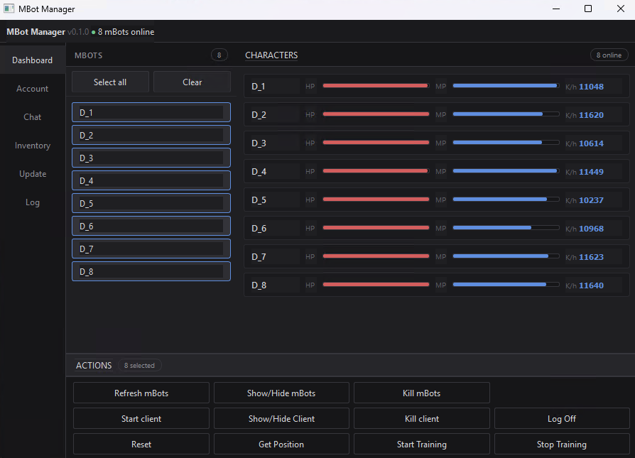
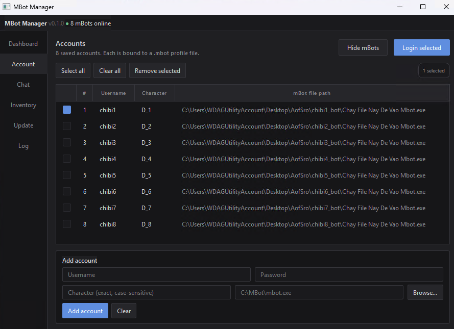
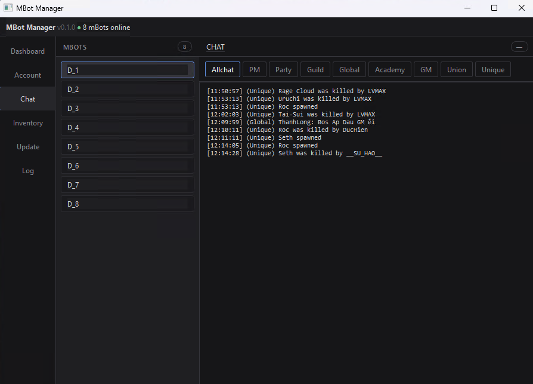
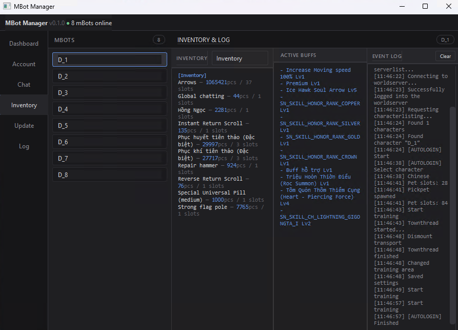
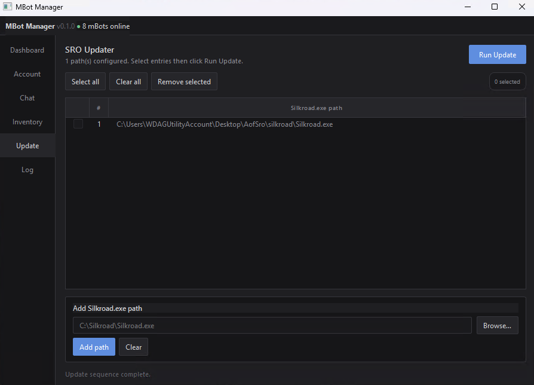
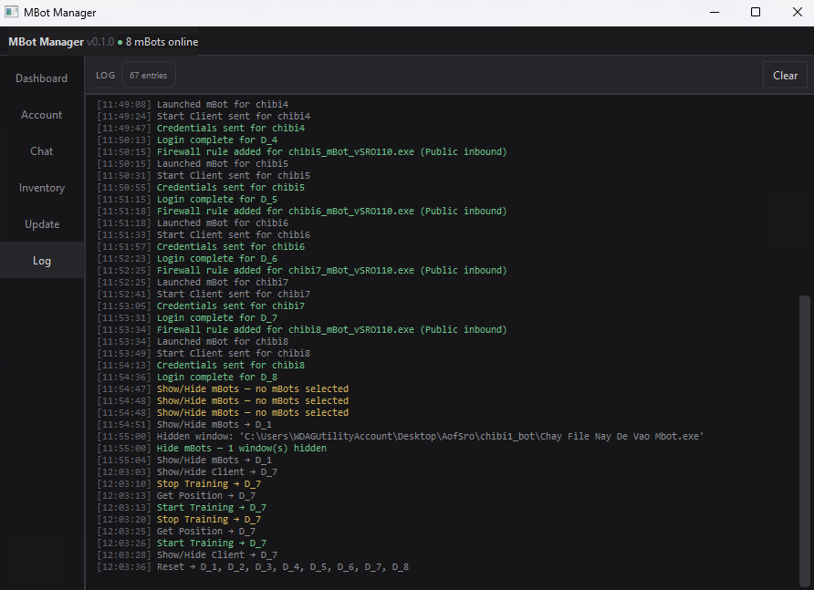

# mBot Manager

A tool for managing multiple mBot windows simultaneously on Silkroad Online (vSRO 110).

> **Note:** This tool does not replace mBot. You must install and fully configure mBot first (profile, script, settings). mBot Manager only automates repetitive tasks on each startup — opening mBot, logging in, starting training, hiding windows, and updating the SRO client.

---

## Download

1. Click the **Code** button (green, top right)
2. Select **Download ZIP**
3. Extract to any folder, e.g. `C:\MBotManager`

---

## First-time Setup

Double-click `setup.bat` — it automatically downloads Python 3.11 portable and installs all dependencies (~5 minutes, internet required). Does not affect any existing Python installation on your machine.

---

## Daily Use

Double-click `launch.bat` to open.

Or use the following batch files to automate on startup:

| File | Action |
| --- | --- |
| `launch.bat` | Open the tool normally |
| `launch_autologin.bat` | Open, update first, then auto-login |
| `sandbox.bat` | Hide and visible the Sandbox Window |

---

## Features

### Dashboard


View all running mBot windows, monitor HP/MP/K/h in real time, and control them in bulk.

| Button | Action |
| --- | --- |
| Refresh mBots | Re-scan for active mBot windows |
| Show/Hide mBots | Toggle mBot window visibility |
| Kill mBots | Close mBot |
| Start/Kill Client | Start or kill the SRO client |
| Show/Hide Client | Toggle SRO client visibility |
| Log Off | Log out the character |
| Reset | Reset mBot |
| Get Position | Fetch current coordinates |
| Start/Stop Training | Start or stop training |

Select multiple mBots with Ctrl+click or **Select all**.

---

### Account


Save login credentials and automatically run the full login sequence on each restart:

1. Launch `mbot.exe`
2. Click Start Client → wait for SRO client to load
3. Select server → enter username/password → enter game
4. Start Training → hide SRO client → hide mBot window

If mBot for that account is already open, it is skipped.

Once all accounts have finished logging in, the tool automatically hides all mBot windows.

Passwords are stored as base64 in `accounts.json` — keep this file private, do not share it.

| Button | Action |
| --- | --- |
| Login selected | Run the login sequence for selected accounts |
| Hide mBots | Hide mBot windows by their exe filename |

---

### Chat


View chat content by channel (Allchat, PM, Party, Guild, Global, Academy, GM, Union, Unique). Auto-refreshes every 20 seconds.

---

### Inventory & Log


View inventory by type (Avatar, Fellow, Guildstorage, Inventory, Pet, Storage), active buffs, and the mBot event log.

---

### Update


Manage and automatically update SRO clients (`Silkroad.exe`). Add paths to each `Silkroad.exe`, select them, and click **Run Update**.

Update sequence per file:

1. Kill any running `silkroad.exe` process
2. Launch `Silkroad.exe`
3. Check the number of window controls every 10 seconds
4. If controls reach the target (update complete) → kill process → move to next file
5. If 60 seconds pass with no completion → kill process → move to next file

**Automatic monitoring:**

Every 2 minutes, the tool checks all `sro_client.exe` windows:

| Dialog | Action |
| --- | --- |
| `BSObj Plugin` | Click OK + trigger update sequence |
| `NetError` | Click OK only, no update |

Paths are saved in `updater.json`.

---

### Log


Activity history of the tool: scans, logins, updates, errors, etc.

---

## Command-line Arguments

```
python mbot_manager.py [--autologin] [--update]
```

| Argument | Action |
| --- | --- |
| `--autologin` | Auto-login all accounts on startup |
| `--update` | Auto-update all SRO clients on startup |
| `--update --autologin` | Update first, then login |

---

## Notes

- Windows only.
- The login sequence uses fixed delays — slow machines or laggy connections may require adjusting the wait times in the code.
---

---

# Architecture v2 — Core + GUI split

> This section documents the new architecture added alongside the original `mbot_manager.py` (which remains untouched as reference).

## Overview

The original monolithic file mixes Win32 window automation, Qt timers, and UI code together. The v2 architecture separates them into three layers:

```
┌─────────────────────────────────────┐
│          GUI layer (choose one)     │
│   gui_qt/main.py  │  gui_web/       │
│   (PyQt6, local)  │  (FastAPI+HTML) │
└────────────┬──────┴────────┬────────┘
             │  SQLite3 DB   │
             │  (read state, │
             │  write cmds)  │
┌────────────▼───────────────▼────────┐
│         core/worker.py              │
│  (background process, Win32 only)   │
└─────────────────────────────────────┘
```

- **core/** — all Win32 interaction, no Qt dependency, runs as a standalone subprocess
- **SQLite3** (`mbot_state.db`) — shared state bus between worker and GUI
- **gui_qt/** — PyQt6 GUI that reads state from DB, sends commands via DB
- **gui_web/** — FastAPI + Tailwind web UI, accessible over Tailscale from mobile

---

## Project structure

```
mbot_manager/
├── mbot_manager.py        ← original (reference, do not modify)
├── core/
│   ├── window.py          ← MBotWindow, win32 helpers, scan_mbot_windows
│   ├── db.py              ← SQLite3 schema + read/write helpers
│   ├── worker.py          ← background process (5 threads)
│   └── login.py           ← login sequence (QTimer → threading)
├── gui_qt/
│   └── main.py            ← PyQt6 GUI, reads from DB, enqueues commands
├── gui_web/
│   ├── server.py          ← FastAPI + WebSocket
│   └── static/
│       ├── index.html
│       └── app.js         ← Tailwind dark UI
├── accounts.json
├── updater.json
└── mbot_state.db          ← auto-created on first run
```

---

## Running

### Step 1 — start the core worker (required, needs Win32)

```bash
python -m core.worker
```

This starts 5 daemon threads:

| Thread | Interval | Job |
|--------|----------|-----|
| `scan` | 5 s | detect mBot window changes → write `mbots` table |
| `poll` | 0.5 s | read HP/MP/KPH from each window → update `mbots` |
| `chat` | 2 s | read all chat channels → write `chat` table |
| `bsobj` | 60 s | dismiss BSObj/NetError/Error dialogs, trigger update if needed |
| `cmd` | 0.5 s | read `commands` table, execute, mark done |

### Step 2 — start a GUI (choose one)

**PyQt6 (local desktop):**
```bash
python -m gui_qt.main
```

**Web UI (accessible over Tailscale):**
```bash
uvicorn gui_web.server:app --host 0.0.0.0 --port 8765
```
Then open `http://<tailscale-ip>:8765` from your phone.

---

## SQLite3 schema (`mbot_state.db`)

| Table | Written by | Read by | Purpose |
|-------|-----------|---------|---------|
| `mbots` | worker | both GUIs | live mbot state (hp, mp, kph, is_dc) |
| `logs` | worker | both GUIs | event log entries |
| `chat` | worker | both GUIs | per-mbot per-channel chat snapshots |
| `commands` | GUI | worker | command queue (GUI → worker) |
| `inventory` | worker | gui_qt | inventory items per mbot per type |
| `mbot_log` | worker | gui_qt | mBot event log (raw text) |

---

## Command reference

Send a command from Python:
```python
from core import db
db.enqueue_command("start_training", target_id=2)
db.enqueue_command("login", params={"indices": [0, 1, 2]})
```

Or via REST:
```bash
curl -X POST http://localhost:8765/api/command \
  -H "Content-Type: application/json" \
  -d '{"action": "start_training", "target_id": 2}'
```

| Action | `target_id` | `params` | Description |
|--------|------------|---------|-------------|
| `start_training` | mbot id | — | Start training |
| `stop_training` | mbot id | — | Stop training |
| `start_client` | mbot id | — | Start SRO client |
| `kill_client` | mbot id | — | Kill SRO client |
| `kill_mbot` | mbot id | — | Close mBot window |
| `show_hide_mbot` | mbot id | — | Toggle mBot visibility |
| `show_hide_client` | mbot id | — | Toggle client visibility |
| `log_off` | mbot id | — | Log off character |
| `reset` | mbot id | — | Reset mBot |
| `get_position` | mbot id | — | Get + save current position |
| `set_delay` | mbot id | — | Set relogin delay to 999 |
| `get_inventory` | mbot id | `{"inv_type": "Inventory"}` | Fetch inventory → DB |
| `get_mbot_log` | mbot id | — | Fetch event log → DB |
| `login` | — | `{"indices": [0,1]}` | Full login sequence for accounts |
| `hide_mbots` | — | `{"indices": [0,1]}` | Hide mBot windows by exe |
| `start_training_all` | — | — | Start training on all mbots |
| `run_update` | — | `{"indices": [0,1]}` or omit for all | Run SRO updater sequence |

`target_id = null` applies the action to all live mBots.

---

## Web API

Base URL: `http://localhost:8765`

| Method | Path | Description |
|--------|------|-------------|
| `GET` | `/api/mbots` | List all live mbots |
| `GET` | `/api/logs?limit=200` | Recent log entries |
| `GET` | `/api/chat/{mbot_id}/{channel}` | Chat content |
| `GET` | `/api/accounts` | Accounts (passwords stripped) |
| `POST` | `/api/command` | Enqueue a command |
| `WS` | `/ws` | Push state every 500 ms |

WebSocket message format:
```json
{
  "mbots": [ { "id": 1, "char": "Hero", "hp": 95.2, "mp": 80.0, "kph": "312", "is_dc": 0 } ],
  "logs":  [ { "id": 42, "ts": "12:34:56", "msg": "...", "kind": "ok" } ]
}
```

---

## Dependencies (v2)

```bash
pip install PyQt6 pywin32 pywinauto uiautomation psutil fastapi uvicorn
```

---
# mBot Manager (Vietnamese)

Công cụ hỗ trợ quản lý nhiều mBot cùng lúc trên Silkroad Online (vSRO 110).

> **Lưu ý:** Tool này không thay thế mBot. Bạn cần cài đặt và cấu hình mBot đầy đủ trước (profile, script, settings). mBot Manager chỉ hỗ trợ tự động hóa các thao tác lặp đi lặp lại mỗi khi tắt/mở máy — mở mBot, đăng nhập, bắt đầu train, ẩn cửa sổ, và cập nhật SRO client.

---

## Tải về

1. Bấm nút **Code** (màu xanh lá, góc phải trên)
2. Chọn **Download ZIP**
3. Giải nén vào thư mục tùy ý, ví dụ `C:\MBotManager`

---

## Cài đặt lần đầu

Double-click `setup.bat` — script tự tải Python 3.11 portable và cài dependencies (~5 phút, cần internet). Không ảnh hưởng đến Python đã cài trên máy.

---

## Sử dụng hàng ngày

Double-click `launch.bat` để mở.

Hoặc dùng các file bat sau để tự động hóa khi khởi động:

| File | Tác dụng |
| --- | --- |
| `launch.bat` | Mở tool bình thường |
| `launch_autologin.bat` | Mở, update xong rồi mới tự động login |
| `sandbox.bat` | Ẩn and hiện the Sandbox Window |

---

## Tính năng

### Dashboard


Xem danh sách mBot đang chạy, theo dõi HP/MP/K/h theo thời gian thực, điều khiển hàng loạt.

| Nút | Tác dụng |
| --- | --- |
| Refresh mBots | Quét lại danh sách cửa sổ mBot |
| Show/Hide mBots | Ẩn/hiện cửa sổ mBot |
| Kill mBots | Đóng mBot |
| Start/Kill Client | Bật/tắt SRO client |
| Show/Hide Client | Ẩn/hiện SRO client |
| Log Off | Đăng xuất nhân vật |
| Reset | Reset mBot |
| Get Position | Lấy tọa độ hiện tại |
| Start/Stop Training | Bắt đầu/dừng train |

Chọn nhiều mBot bằng Ctrl+click hoặc **Select all**.

---

### Account


Lưu thông tin đăng nhập và tự động chạy toàn bộ trình tự mỗi khi khởi động lại máy:

1. Mở `mbot.exe`
2. Click Start Client → chờ SRO client load
3. Chọn server → nhập tài khoản/mật khẩu → vào game
4. Start Training → ẩn SRO client → ẩn cửa sổ mBot

Nếu mBot của account đó đã đang mở thì bỏ qua, không mở thêm.

Sau khi toàn bộ account login xong, tool tự động ẩn tất cả cửa sổ mBot.

Mật khẩu lưu dạng base64 trong `accounts.json` — giữ file này riêng tư, không chia sẻ.

| Nút | Tác dụng |
| --- | --- |
| Login selected | Chạy trình tự login cho các account đã chọn |
| Hide mBots | Ẩn cửa sổ mBot theo tên file exe của từng account |

---

### Chat


Xem nội dung chat theo kênh (Allchat, PM, Party, Guild, Global, Academy, GM, Union, Unique). Tự refresh mỗi 20 giây.

---

### Inventory & Log


Xem inventory theo loại (Avatar, Fellow, Guildstorage, Inventory, Pet, Storage), active buffs, và event log của mBot.

---

### Update


Quản lý và tự động update SRO client (`Silkroad.exe`). Thêm đường dẫn tới từng file `Silkroad.exe`, chọn rồi bấm **Run Update**.

Trình tự update cho mỗi file:

1. Kill process `silkroad.exe` đang chạy (nếu có)
2. Mở `Silkroad.exe`
3. Kiểm tra số lượng controls mỗi 10 giây
4. Nếu controls đạt đủ (update xong) → kill process → chuyển sang file tiếp theo
5. Nếu sau 60 giây vẫn chưa xong → kill process → chuyển tiếp

**Tự động theo dõi:**

Mỗi 2 phút, tool tự kiểm tra các cửa sổ `sro_client.exe`:

| Dialog | Hành động |
| --- | --- |
| `BSObj Plugin` | Bấm OK + kích hoạt trình tự update |
| `NetError` | Bấm OK, không update |

Đường dẫn lưu trong `updater.json`.

---

### Log


Lịch sử hoạt động của tool: scan, login, update, lỗi, v.v.

---

## Tham số dòng lệnh

```
python mbot_manager.py [--autologin] [--update]
```

| Tham số | Tác dụng |
| --- | --- |
| `--autologin` | Tự động login tất cả account sau khi mở |
| `--update` | Tự động update tất cả SRO client sau khi mở |
| `--update --autologin` | Update xong rồi mới login |

---

## Lưu ý

- Chỉ chạy trên **Windows**.
- Login sequence dùng delay cố định — máy yếu hoặc mạng lag có thể cần điều chỉnh thời gian chờ trong code.

---

# Kiến trúc v2 — Tách Core + GUI

> Phần này mô tả kiến trúc mới được thêm song song với `mbot_manager.py` gốc (file gốc giữ nguyên, không sửa, dùng làm tham chiếu).

## Tổng quan

File monolithic gốc trộn lẫn Win32, Qt timer và UI vào một chỗ. Kiến trúc v2 tách thành 3 tầng:

```
┌─────────────────────────────────────┐
│           Tầng GUI (chọn một)       │
│   gui_qt/main.py  │  gui_web/       │
│   (PyQt6, local)  │  (FastAPI+HTML) │
└────────────┬──────┴────────┬────────┘
             │  SQLite3 DB   │
             │  (đọc state,  │
             │   ghi lệnh)   │
┌────────────▼───────────────▼────────┐
│         core/worker.py              │
│  (process nền, chỉ cần Win32)       │
└─────────────────────────────────────┘
```

- **core/** — toàn bộ Win32, không phụ thuộc Qt, chạy độc lập như subprocess
- **SQLite3** (`mbot_state.db`) — bus trạng thái chung giữa worker và GUI
- **gui_qt/** — PyQt6 GUI đọc state từ DB, gửi lệnh qua DB
- **gui_web/** — FastAPI + Tailwind, truy cập qua Tailscale từ điện thoại

---

## Cấu trúc thư mục

```
mbot_manager/
├── mbot_manager.py        ← file gốc (tham chiếu, không sửa)
├── core/
│   ├── window.py          ← MBotWindow, win32 helpers, scan
│   ├── db.py              ← SQLite3 schema + CRUD
│   ├── worker.py          ← process nền (5 threads)
│   └── login.py           ← login sequence (QTimer → threading)
├── gui_qt/
│   └── main.py            ← PyQt6 GUI, đọc DB, enqueue commands
├── gui_web/
│   ├── server.py          ← FastAPI + WebSocket
│   └── static/
│       ├── index.html
│       └── app.js         ← Tailwind dark UI
├── accounts.json
├── updater.json
└── mbot_state.db          ← tự tạo lần đầu chạy
```

---

## Cách chạy

### Bước 1 — khởi động core worker (bắt buộc, cần Win32)

```bash
python -m core.worker
```

Worker chạy 5 daemon thread:

| Thread | Chu kỳ | Việc làm |
|--------|--------|---------|
| `scan` | 5 s | detect thay đổi cửa sổ mBot → ghi bảng `mbots` |
| `poll` | 0.5 s | đọc HP/MP/KPH từng cửa sổ → update `mbots` |
| `chat` | 2 s | đọc tất cả kênh chat → ghi bảng `chat` |
| `bsobj` | 60 s | dismiss dialog BSObj/NetError/Error, kích update nếu cần |
| `cmd` | 0.5 s | đọc bảng `commands`, thực thi, đánh dấu done |

### Bước 2 — khởi động GUI (chọn một)

**PyQt6 (desktop local):**
```bash
python -m gui_qt.main
```

**Web UI (điều khiển qua điện thoại qua Tailscale):**
```bash
uvicorn gui_web.server:app --host 0.0.0.0 --port 8765
```
Mở `http://<tailscale-ip>:8765` trên điện thoại.

---

## Schema SQLite3 (`mbot_state.db`)

| Bảng | Ghi bởi | Đọc bởi | Mục đích |
|------|---------|---------|---------|
| `mbots` | worker | cả 2 GUI | trạng thái live (hp, mp, kph, is_dc) |
| `logs` | worker | cả 2 GUI | log sự kiện |
| `chat` | worker | cả 2 GUI | snapshot chat từng mbot, từng kênh |
| `commands` | GUI | worker | hàng đợi lệnh (GUI → worker) |
| `inventory` | worker | gui_qt | items inventory theo loại |
| `mbot_log` | worker | gui_qt | event log raw từ mBot |

---

## Danh sách lệnh (command reference)

Gửi lệnh từ Python:
```python
from core import db
db.enqueue_command("start_training", target_id=2)
db.enqueue_command("login", params={"indices": [0, 1, 2]})
```

Hoặc qua REST:
```bash
curl -X POST http://localhost:8765/api/command \
  -H "Content-Type: application/json" \
  -d '{"action": "start_training", "target_id": 2}'
```

| Action | `target_id` | `params` | Mô tả |
|--------|------------|---------|-------|
| `start_training` | mbot id | — | Bắt đầu train |
| `stop_training` | mbot id | — | Dừng train |
| `start_client` | mbot id | — | Mở SRO client |
| `kill_client` | mbot id | — | Tắt SRO client |
| `kill_mbot` | mbot id | — | Đóng cửa sổ mBot |
| `show_hide_mbot` | mbot id | — | Ẩn/hiện cửa sổ mBot |
| `show_hide_client` | mbot id | — | Ẩn/hiện client |
| `log_off` | mbot id | — | Đăng xuất nhân vật |
| `reset` | mbot id | — | Reset mBot |
| `get_position` | mbot id | — | Lấy + lưu tọa độ hiện tại |
| `set_delay` | mbot id | — | Đặt delay relogin = 999 |
| `get_inventory` | mbot id | `{"inv_type": "Inventory"}` | Lấy inventory → ghi DB |
| `get_mbot_log` | mbot id | — | Lấy event log → ghi DB |
| `login` | — | `{"indices": [0,1]}` | Chạy login sequence cho accounts |
| `hide_mbots` | — | `{"indices": [0,1]}` | Ẩn cửa sổ mBot theo exe |
| `start_training_all` | — | — | Start training tất cả mBot |
| `run_update` | — | `{"indices": [0,1]}` hoặc bỏ qua để update tất cả | Chạy update SRO |

`target_id = null` áp dụng lệnh cho tất cả mBot đang chạy.

---

## Web API

Base URL: `http://localhost:8765`

| Method | Path | Mô tả |
|--------|------|-------|
| `GET` | `/api/mbots` | Danh sách mBot live |
| `GET` | `/api/logs?limit=200` | Log gần nhất |
| `GET` | `/api/chat/{mbot_id}/{channel}` | Nội dung chat |
| `GET` | `/api/accounts` | Danh sách account (không có password) |
| `POST` | `/api/command` | Enqueue lệnh |
| `WS` | `/ws` | Push state mỗi 500 ms |

## Dependencies (v2)

```bash
pip install PyQt6 pywin32 pywinauto uiautomation psutil fastapi uvicorn
```

---